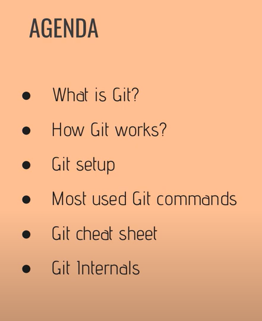
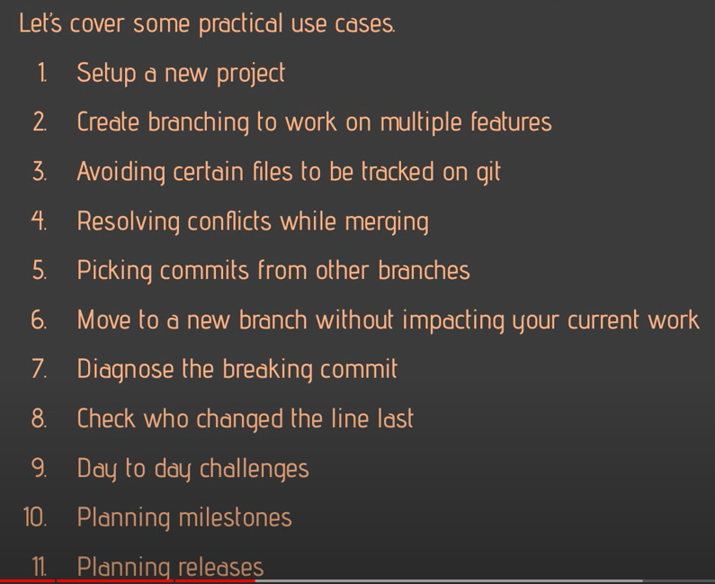
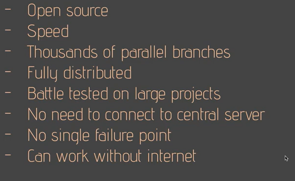
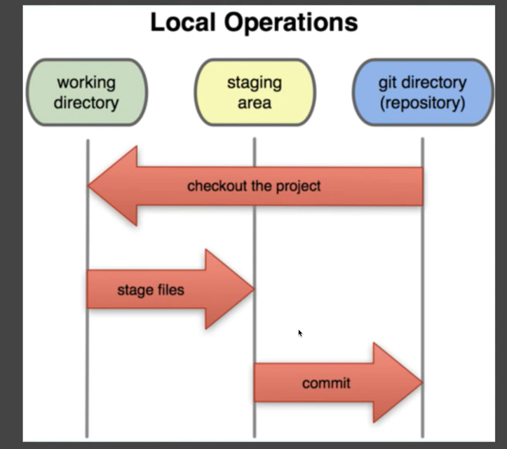
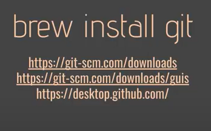
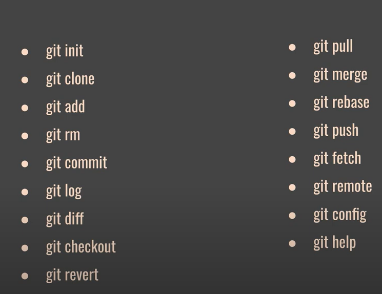
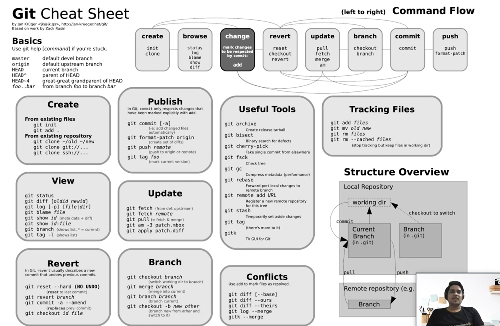

# Git

## Agenda

## Practical use cases:

## What is Git?

Git is a Distributed ( Decentralized ) Version Control System.

## Working

## Git Setup

## Most used Git commands

## Git Cheat Sheet

## Git Internals

### Git clone:

1. goto the location
2. type "git clone HTTPS URL"
3. Enter

### ls or dir :

To see the file and folder inside workspace.

- git init
- git status
- git add fileName filName (or . to add all files)
- git commit -m "message"
- -u means upstream

### git log

### Configuration

- git config --local user.email emailid
- git config --local user.name username

<--------------------------------------------------->

# Hitesh ( LCO )

## Why Git?

- Verson Control

- Design.png -> DesignFinal.png -> DesignFinalV1.png -> DesignFinalV2.png

- Software revert is more than ctrl + Z

- VCS ( Version Control System ) it controlles versions of a system and multiple people works on it. v/s SCM ( Source Code Management ) manages source code for us.

- Past - CVS, SVN

## Git

- 2005 - By Linus Torvalds
- It is open source and free
- Available for Mac, Linux, and Windows
- Github hosts your repositories.
- But repos can be hosted on other places too.

## Uses:

- Collaboration
- Every user maintains their own repos
- Git track changes
- Merge the changes

## Pros

- No Single point of failure
- Forking ( coping the code ) is encouraged
- Go your own way - Example - MariaDB

## Installing

- goto git-scm.com
- download & install

## Git bash command

- where
- which
- git --version
