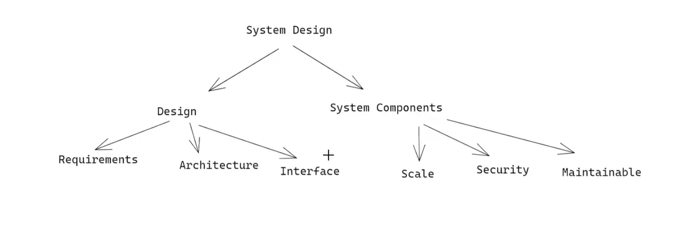
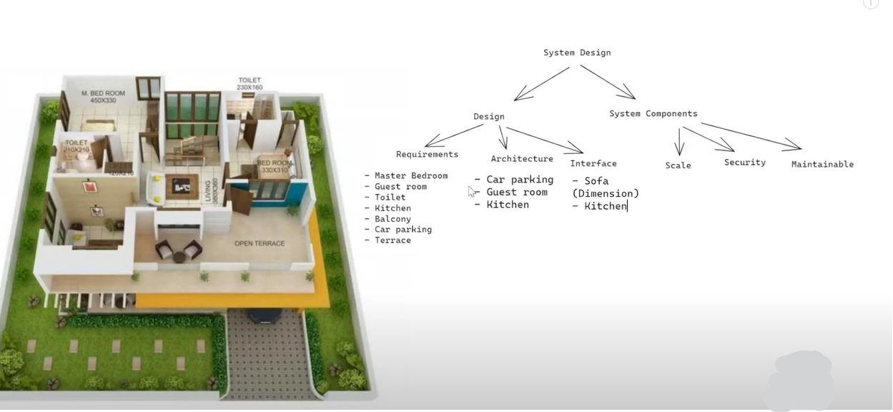

# 
<u>System Design</u>

## What is System Design?

We have to build a system for that we need a detailed design.

### System Design

When we design any system we need two things:

1. **Design**
   - **Requirements** ( You must know what are your requirements ).
   - **Architecture** ( What will fit where ).
   - **Interface** ( How it looks like ).
2. **System Components**
   - **Scale** ( It must be scalable ).
   - **Security** ( It must be secure ).
   - **Maintainable** ( It should be maintainable ).
   - etc.

### Real-life Example:

